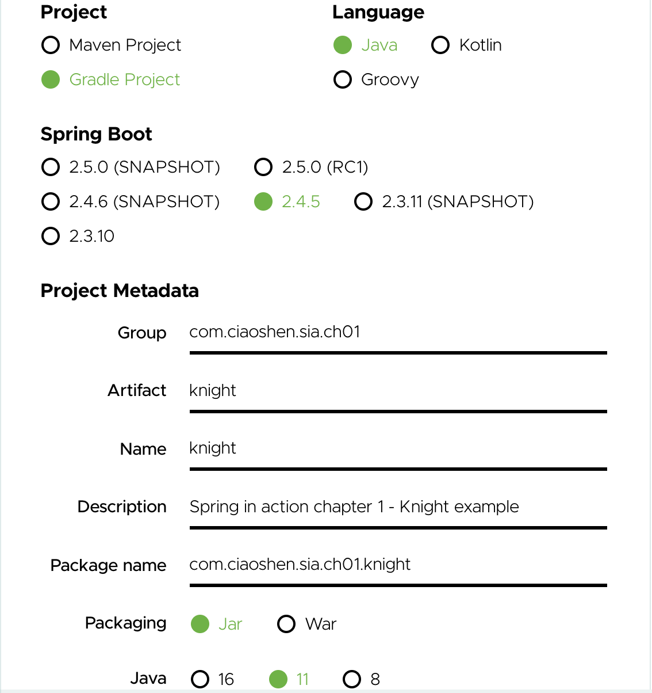

### Install Spring
Spring doesn't need to be installed. It's released as a bunch of `.jar` libraries. Just add `dependencies` into `build.gradle` file,
```groovy
dependencies {
	implementation 'org.springframework.boot:spring-boot-starter'
}
```

Suggest to visit: <https://start.spring.io/> to initialize a `gradle` or `maven` project online. Configure as follow, we can download `knight.zip`,


Unzip `knight.zip` file, move it to ROOT of this chapter: `~/github/spring-in-action/ch01/`,
```
ch01
└── knight
    ├── HELP.md
    ├── README.md
    ├── build.gradle
    ├── gradle
    │   └── wrapper
    │       ├── gradle-wrapper.jar
    │       └── gradle-wrapper.properties
    ├── gradlew
    ├── gradlew.bat
    ├── settings.gradle
    └── src
        ├── main
        │   ├── java
        │   │   └── com
        │   │       └── ciaoshen
        │   │           └── sia
        │   │               └── ch01
        │   │                   └── knight
        │   │                       └── KnightApplication.java
        │   └── resources
        │       └── application.properties
        └── test
            └── java
                └── com
                    └── ciaoshen
                        └── sia
                            └── ch01
                                └── knight
                                    └── KnightApplicationTests.java
```

This is nothing but an empty `gradle` project with default setting. The only important thing it does, is define the spring `dependencies` into `build.gradle` for us,
```groovy
dependencies {
	implementation 'org.springframework.boot:spring-boot-starter'
	testImplementation 'org.springframework.boot:spring-boot-starter-test'
}
```

To view the entire spring released libraries, please go to `[Spring release repository]`: <https://repo.spring.io/release/org/springframework/spring/>

### ch01 project
Since online spring initializer just add `spring-boot-starter` dependency, we have no need to use it. We can simply generate a basic gradle project,
```
gradle init
```
choose `basic` option and we get an empty gradle project (for more information about gradle initialization, check: <https://github.com/helloShen/spring-in-action/blob/7acc67db3c16e4b869eb0b708d4c25d1b6576901/demo/gradle-demo/README.md>),
```
├── README.md
├── build.gradle
├── gradle
│   └── wrapper
│       ├── gradle-wrapper.jar
│       └── gradle-wrapper.properties
├── gradlew
├── gradlew.bat
└── settings.gradle
```

Add a `knight` sub-directory, and move `build.gradle` into it. Then include this `knight` repository as a sub-project in `settings.gradle`,
```groovy
rootProject.name = 'ch01'
include 'knight
```
Now we have a simplest `multi-subproject` gradle project.
```
├── README.md
├── gradle
│   └── wrapper
│       ├── gradle-wrapper.jar
│       └── gradle-wrapper.properties
├── gradlew
├── gradlew.bat
├── knight
│   ├── build.gradle
│   └── src
│       ├── main
│       │   ├── java
│       │   └── resources
│       └── test
│           ├── java
│           └── resources
└── settings.gradle
```

Run command `projects` to check our `ch01` project structure,
```
gradle -q projects
```
It shows that `knight` is one of the sub-project of `ch01` root project.
```
------------------------------------------------------------
Root project 'ch01'
------------------------------------------------------------

Root project 'ch01'
\--- Project ':knight'
```

Run `gradle build` in root directory `ch01` will buill all sub-projects. If we go to `ch01/knight` sub-directory, and run `gradle build` will only build `knight` sub project.

### Knight project
##### Step1: Create 4 basic class:
    1. `Knight.java` (interface)
    2. `BraveKnight.java`
    3. `Quest.java` (interface)
    4. `SlayDragonQuest.java`

##### Step2: Configurate Beans 
Using `@Bean` annotation in `KnightConfig.java`,
```java
@Configuration
public class KnightConfig {

    @Bean
    public Knight knight() {
        return new BraveKnight(quest());
    }

    @Bean
    public Quest quest() {
        return new SlayDragonQuest(System.out);
    }
}
```

##### Step3: Create ApplicationContext
In `KnightMain.java`,
```java
/* load spring context, defined by annotation in 'KnightConfig.java' */
GenericApplicationContext context = new AnnotationConfigApplicationContext(KnightConfig.class);
/* get knight bean */
Knight knight = context.getBean(Knight.class);
/* use knight bean */
knight.embarkOnQuest();
```
!!Note: we use `GenericApplicationContext` instead of `ApplicationContext` just because the latter doesn't have `close()` method.

##### Step4: Add dependencies
Add `spring-context` library in `build.gradle`,
```
dependencies {
    implementation group: 'org.springframework', name: 'spring-context', version: '5.3.6'
}
```
Add `java` and `application` plugin,
```
plugins {
    id 'java'
    id 'application'
}

application {
    mainClass = 'com.ciaoshen.sia.ch01.knight.KnightMain'
}
```

Using gradle to build Knight application,
```
gradle build
```

Run Knight application,
```
gradle run
```
It works,
```
Wei@MacBook-Pro-de-Wei:~/github/sia/ch01/knight% gradle run

> Task :knight:run
Embarking on quest to slay the dragon!

BUILD SUCCESSFUL in 1s
```

### Test Knight
For more information about junit settings in gradle, check my note of junit-demo: <>
Add `dependencies` into `build.gradle`,
```groovy
dependencies {
    testImplementation(platform('org.junit:junit-bom:5.7.1'))
	testImplementation('org.junit.jupiter:junit-jupiter')
    testImplementation group: 'org.mockito', name: 'mockito-all', version: '1.10.19'
}
```

Add `test` task into `build.gradle`, call `useJUnitPlatform()` to activate junit test engine and set options,
```groovy
test {
    useJUnitPlatform()
    testLogging {
        events "passed", "skipped", "failed"
    }
}
```

Run gradle `test` task,
```
gradle test
```

Test passed,
```
Wei@MacBook-Pro-de-Wei:~/github/sia/ch01/knight% gradle test

> Task :knight:test

BraveKnightTest > knightShouldEmbarkOnQuest() PASSED

BUILD SUCCESSFUL in 6s
```


### References
1. Spring Online Initializer: <https://start.spring.io/>
1. Interesting Spring IoC article: <https://www.zhihu.com/question/23277575/answer/169698662>