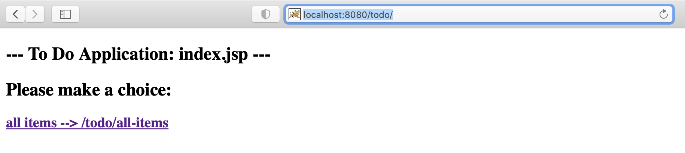
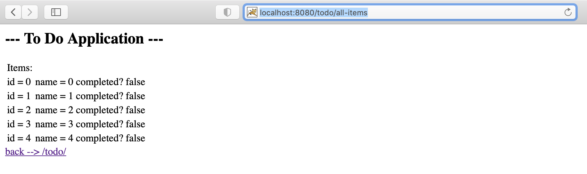

### TODO Web Application Design
Servlet `ToDoServlet.java` dispatch URL:`http://localhost:8080/todo/` to JSP page `jsp/index.jsp`,

By clicking the link `all-items` below, servlet `ToDoServlet.java` generates randomly some new items, adds them to request attribute, then dispatches request to URL:`http://localhost:8080/todo/all-items`, which corresponds to JSP page `jsp/all-items.jsp`,


### Install Gradle
```
brew install gradle
```

Configure `PATH` environment in my `~/.bash_profile` and `~/.zshrc`,
```
export PATH=$PATH:/opt/gradle/gradle-7.0/bin
```

Check gradle version. We have the newest `Gradle 7.0`.
```
gradle -v
```

### Gradle
Initialize project using gradle,
```
gradle init
```
select `basic` project, set the project name `todo`. We get an empty project as below,
```
.
├── build.gradle
├── gradle
│   └── wrapper
│       ├── gradle-wrapper.jar
│       └── gradle-wrapper.properties
├── gradlew
├── gradlew.bat
└── settings.gradle
```
1. mainly work in `build.gradle` file.
2. `gradlew` is gradle wrapper bash script. If you cooperate with someone else, they can use this script to run the same version of gradle without installing it to their local working space. 
    a. `gradlew` is the Linux version.
    b. `gradlew.bat` stands for Window system. 
    c. `gradle-wrapper.jar` is the gradle runtime library. 
    d. `gradle-wrapper.properties` refers to the configuration file.
3. `settings.gradle` is gradle meta-configurations.

### Work with gradle
In `build.gradle` we use `java` plugin and `war` plugin's default settings. Since we use `servlet` in our project, an extra dependencies `jakarta.servlet` is required. 
<b>!!IMPORTANT: We use Tomcat v-10.0.5 as server. It migrate to `Servlet 5.0`, which uses `jakarta.servlet` instead of `javax.servlet`.</b>

The `mavenCentral()` allows us to download dependencies libraries from `Maven Central Repository`.

```
apply plugin: 'java'
apply plugin: 'war'

repositories {
    mavenCentral()
}

dependencies {
    compileOnly group: 'jakarta.servlet', name: 'jakarta.servlet-api', version: '5.0.0'
}
```

### Project Deployment
Create `src` directory. Our web application structure looks like,
```
└── src
    └── main
        ├── java
        │   └── com
        │       └── ciaoshen
        │           └── sia
        │               └── demo
        │                   └── gradle_demo
        │                       └── todo
        │                           ├── model
        │                           │   └── ToDoItem.java
        │                           └── web
        │                               └── ToDoServlet.java
        └── webapp
            ├── WEB-INF
            │   └── web.xml
            └── jsp
                ├── all-items.jsp
                └── index.jsp
```

Run,
```
build gradle
```
We got everything below,
    1. compiled `class` files are laied out under `build/classes` directory.
    2. `todo.war` are packaged under `build/libs` repository.
    3. compressed package is located in `build/distributions`.
```
├── build
│   ├── classes
│   │   └── java
│   │       └── main
│   │           └── com
│   │               └── ciaoshen
│   │                   └── sia
│   │                       └── demo
│   │                           └── gradle_demo
│   │                               └── todo
│   │                                   ├── model
│   │                                   │   └── ToDoItem.class
│   │                                   └── web
│   │                                       └── ToDoServlet.class
│   ├── distributions
│   │   ├── todo.tar
│   │   └── todo.zip
│   ├── generated
│   │   └── sources
│   │       ├── annotationProcessor
│   │       │   └── java
│   │       │       └── main
│   │       └── headers
│   │           └── java
│   │               └── main
│   ├── libs
│   │   └── todo.war
│   ├── scripts
│   │   ├── todo
│   │   └── todo.bat
│   └── tmp
│       ├── compileJava
│       │   └── source-classes-mapping.txt
│       ├── jar
│       │   └── MANIFEST.MF
│       └── war
│           └── MANIFEST.MF
```

Execute `jar tf build/libs/todo.war`, we see the structure of `todo.war` file,
    1. compiled class files are located under `WEB-INF/classes` directory.
    2. `web.xml` also lies in `WEB-INF`.
    3. `*.jsp` files stay in `/jsp`.
```
├── META-INF
│   ├── MANIFEST.MF
│   └── war-tracker
├── WEB-INF
│   ├── classes
│   │   └── com
│   │       └── ciaoshen
│   │           └── sia
│   │               └── demo
│   │                   └── gradle_demo
│   │                       └── todo
│   │                           ├── model
│   │                           │   └── ToDoItem.class
│   │                           └── web
│   │                               └── ToDoServlet.class
│   └── web.xml
└── jsp
    ├── all-items.jsp
    └── index.jsp
```

### Run Tomcat
My `$CATALINA_HOME` = `/usr/local/Cellar/tomcat/10.0.5/`. Edit file `libexec/conf/server.xml`. The `appBase` attribute in `<Host>` section defines the web applications location. I set it to,
```
<Host name="localhost"  appBase="~/github/spring-in-action/demo/gradle-demo/build/libs" ... ...>
```
Now Tomcat can find my `todo.war` web application. Start Tomcat,
```
catalina start
```
Open browser and check `localhost:8080/todo/`. When everything is done, shut down tomcat,
```
catalina stop
```