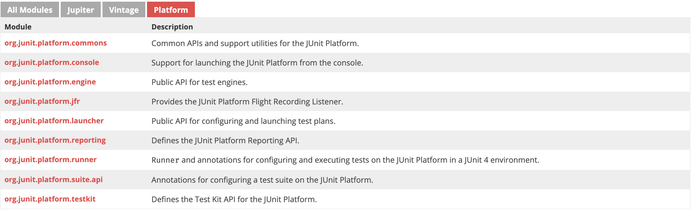

### JUnit 5 Components
JUnit 5 = `JUnit Platform` + `JUnit Jupiter` + `JUnit Vintage`

Here's the best page explaining these three modules of JUnit 5: <https://junit.org/junit5/docs/current/api/>

`junit-jupiter` is the core, especially `org.junit.jupiter.api`. It defines tags(such as `@Test`), and `Assertions` used directly to write a test class.


`junit-platform` defines public `TestEngine` and `Launcher` interfaces between JUnit and third party build tools and IDEs, for example: `gradle`, `maven`, by providing a custom `TestEngine`.


`junit-vintage` provides a TestEngine for running JUnit 3 and JUnit 4 based tests on the platform.


### What's in `build.gradle` file
```groovy
plugins {
	id 'java'
}

repositories {
	mavenCentral()
}

dependencies {
	testImplementation(platform('org.junit:junit-bom:5.7.1'))
	testImplementation('org.junit.jupiter:junit-jupiter')
}

test {
	useJUnitPlatform()
	testLogging {
		events "passed", "skipped", "failed"
	}
}
```

#### `junit-bom`
The junit-bom is JUnit's `Bill Of Materials` (BOM). When including this BOM, it will ensure to resolve version conflicts for you. 

Dependencies version conflicts is a common issue,
```
+- org.springframework:spring-context:jar:5.3.5:compile
|  +- org.springframework:spring-aop:jar:5.3.5:compile
|  |  +- (org.springframework:spring-beans:jar:5.3.5:compile - omitted for duplicate)
|  |  \- (org.springframework:spring-core:jar:5.3.5:compile - omitted for duplicate)
|  +- org.springframework:spring-beans:jar:5.3.5:compile
|  |  \- (org.springframework:spring-core:jar:5.3.5:compile - omitted for duplicate)
...
   +- (org.springframework:spring-expression:jar:5.2.13.RELEASE:compile - omitted for conflict with 5.3.5)
   \- org.springframework:spring-web:jar:5.2.13.RELEASE:compile
      +- (org.springframework:spring-beans:jar:5.2.13.RELEASE:compile - omitted for conflict with 5.3.5)
      \- (org.springframework:spring-core:jar:5.2.13.RELEASE:compile - omitted for conflict with 5.3.5)
```
We can see that there are different versions of the same dependency in the tree. For example, there are two versions of the spring-beans dependency:5.2.13.RELEASE and 5.3.5.

For example, Maven doesn’t know which version is newer or older and cannot choose to always take the newest version. Maven takes the approach of the nearest transitive dependency in the tree depth and the first in resolution.

BOM implements `Dependency Management` for you. By add `platform('org.junit:junit-bom:5.7.1')`, we don't have to specify the version of `junit-jupiter`: `org.junit.jupiter:junit-jupiter:5.7.1`.
```groovy
dependencies {
	testImplementation(platform('org.junit:junit-bom:5.7.1'))
	testImplementation('org.junit.jupiter:junit-jupiter')
}
```


#### `useJunitPlatform()`
Check interesting docs blow: 
1. [JUnit Platform - test grouping] <https://docs.gradle.org/current/userguide/java_testing.html#test_grouping>
2. [org.gradle.api.tasks.testing.Test.useJUnitPlatform()] <https://docs.gradle.org/current/javadoc/org/gradle/api/tasks/testing/Test.html#useJUnitPlatform-org.gradle.api.Action->

JUnit 4.8 introduced the concept of categories for grouping JUnit 4 tests classes and methods. Test.useJUnit(org.gradle.api.Action) allows you to specify the JUnit categories you want to include and exclude. For example, the following configuration includes tests in CategoryA and excludes those in CategoryB for the test task:
```groovy
test {
    useJUnit {
        includeCategories 'org.gradle.junit.CategoryA'
        excludeCategories 'org.gradle.junit.CategoryB'
    }
}
```

JUnit Platform introduced tagging to replace categories. You can specify the included/excluded tags via Test.useJUnitPlatform(org.gradle.api.Action), as follows:
```groovy
test {
    useJUnitPlatform {
        includeTags 'fast'
        excludeTags 'slow'
    }
}
```

The sample below shows various configuration options.

```groovy
 apply plugin: 'java' // adds 'test' task

 test {
   // enable TestNG support (default is JUnit)
   useTestNG()
   // enable JUnit Platform (a.k.a. JUnit 5) support
   useJUnitPlatform()

   // set a system property for the test JVM(s)
   systemProperty 'some.prop', 'value'

   // explicitly include or exclude tests
   include 'org/foo/**'
   exclude 'org/boo/**'

   // show standard out and standard error of the test JVM(s) on the console
   testLogging.showStandardStreams = true

   // set heap size for the test JVM(s)
   minHeapSize = "128m"
   maxHeapSize = "512m"

   // set JVM arguments for the test JVM(s)
   jvmArgs '-XX:MaxPermSize=256m'

   // listen to events in the test execution lifecycle
   beforeTest { descriptor ->
      logger.lifecycle("Running test: " + descriptor)
   }

   // Fail the 'test' task on the first test failure
   failFast = true

   // listen to standard out and standard error of the test JVM(s)
   onOutput { descriptor, event ->
      logger.lifecycle("Test: " + descriptor + " produced standard out/err: " + event.message )
   }
 }
 ```

#### JUnit 5 Gradle Dependency
Important reference: [JUnit 5 Gradle Dependency] <https://howtodoinjava.com/junit5/junit-5-gradle-dependency-build-gradle-example/>

JUnit jupiter is required to have two dependencies i.e. `junit-jupiter-api` and `junit-jupiter-engine`. `junit-jupiter-api` has junit annotations (e.g. `@Test`) to write tests and extensions and `junit-jupiter-engine` has test engine implementation which is required at runtime to execute the tests.

Internally, `junit-jupiter-engine` is dependent on `junit-jupiter-api`, so adding `junit-jupiter-engine` only brings both dependencies into classpath.


We will need `junit-platform-runner` for executing tests and test suites on the JUnit Platform in a JUnit 4 environment.

Internally, `junit-platform-runner` is dependent on `junit-platform-suite-api` and `junit-platform-launcher`, so adding `junit-jupiter-engine` only brings all three dependencies into classpath.

```
junit-jupiter
    junit-jupiter-api
    junit-jupiter-engine
        junit-jupiter-api
        junit-platform-runner
            junit-platform-suite-api
            junit-platform-launcher
```

In conclusion, adding either `junit-jupiter` or `junit-jupiter-engine` brings all dependencies into classpath. Conventionaly, `junit-jupiter` is always a better choise, because it's litteraly an agregate of everything.

### Run Experiment
With application `Calculator.java` and test code `CalculatorTest.java` in `/src` directory, just run,
```
gradle test
```


### References
0. [Three modules of JUnit 5] <https://junit.org/junit5/docs/current/api/>
1. [junit-jupiter, junit-jupiter-bom, and junit platform] <https://stackoverflow.com/questions/67328406/what-is-junit-bom-and-junit-platform-for-and-should-i-include-them-in-gradle-de>
2. [About bom] <https://reflectoring.io/maven-bom/>
3. [JUnit Platform - test grouping] <https://docs.gradle.org/current/userguide/java_testing.html#test_grouping>
4. [org.gradle.api.tasks.testing.Test.useJUnitPlatform()] <https://docs.gradle.org/current/javadoc/org/gradle/api/tasks/testing/Test.html#useJUnitPlatform-org.gradle.api.Action->
5. [JUnit 5 Gradle Dependency] <https://howtodoinjava.com/junit5/junit-5-gradle-dependency-build-gradle-example/>
6. [What is the C runtime library?] <https://stackoverflow.com/questions/2766233/what-is-the-c-runtime-library>
7. [What is “runtime”?] <https://stackoverflow.com/questions/3900549/what-is-runtime>
